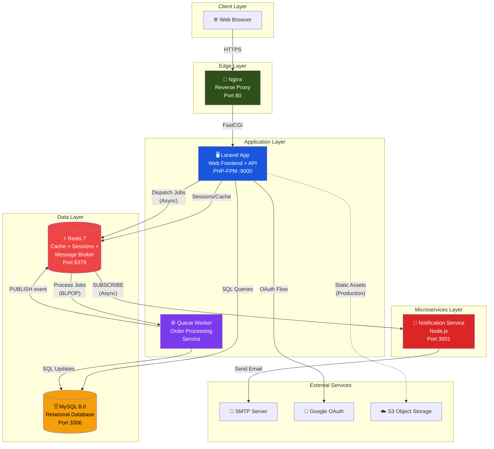
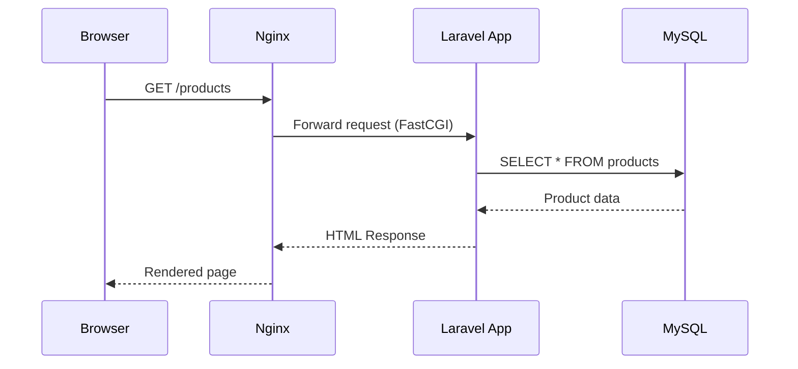
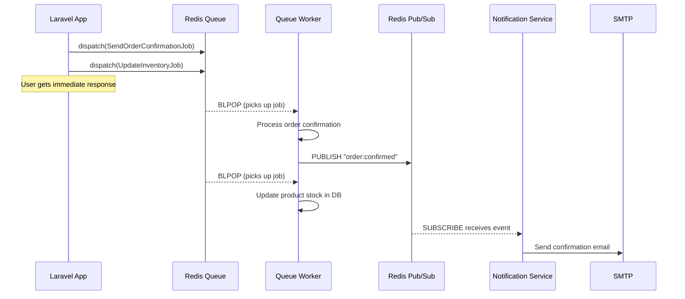
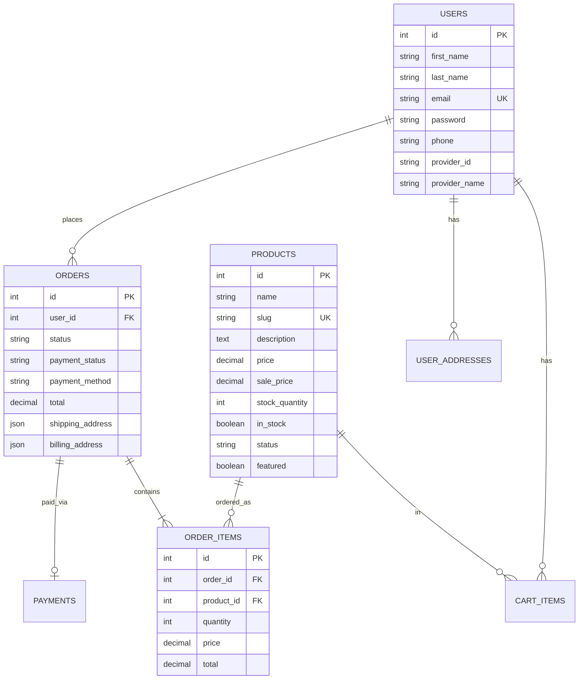
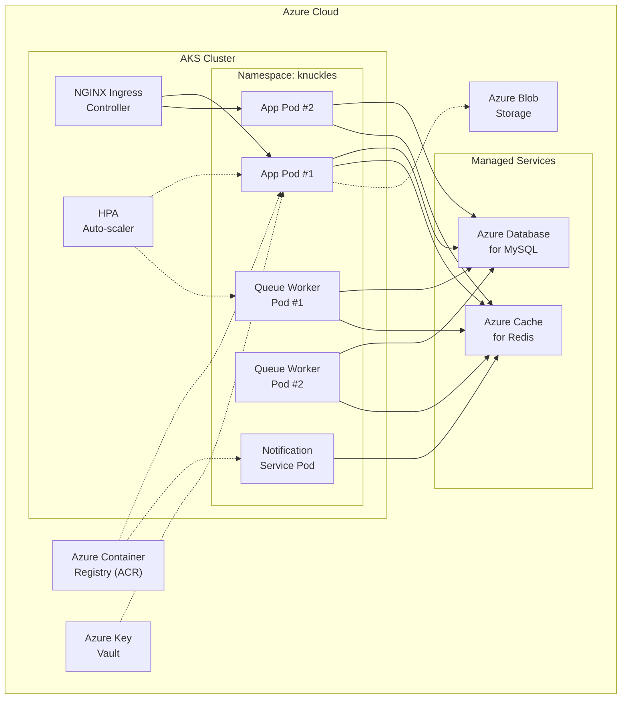

# KnucklesProducts — Cloud-Native Architecture

## Architecture Overview

KnucklesProducts follows a **container-based microservices architecture** where each component runs as an independently deployable Docker container. Services communicate via **synchronous HTTP** (REST) and **asynchronous messaging** (Redis pub/sub queues).

This architecture is designed around the **Twelve-Factor App** methodology and cloud-native principles:
- **Stateless application tier** — sessions and cache externalized to Redis
- **Backing services as attached resources** — database, cache, and queue are separate services
- **Concurrency via process model** — each service scales independently
- **Disposability** — containers start fast and shut down gracefully

---

## System Architecture Diagram



---

## Service Inventory

| Service | Technology | Role | Container | Scaling Strategy |
|---|---|---|---|---|
| **Nginx** | Nginx Alpine | Reverse proxy, load balancing, static assets, SSL termination | `knuckles-nginx` | Horizontal (multiple upstream backends) |
| **Web App** | Laravel 12 / PHP 8.2 | Frontend rendering, REST API, authentication, cart, checkout | `knuckles-app` | Horizontal (stateless, shared Redis sessions) |
| **Queue Worker** | Laravel / PHP 8.2 | Async order processing, inventory updates, notification dispatch | `knuckles-queue-worker` | Horizontal (multiple workers per queue) |
| **Notification Service** | Node.js 20 / Express | Email notifications via Redis pub/sub subscription | `knuckles-notification` | Horizontal (multiple subscribers) |
| **Database** | MySQL 8.0 | Persistent relational data storage | `knuckles-mysql` | Vertical (or RDS read replicas) |
| **Redis** | Redis 7 Alpine | Sessions, cache, message broker (queue + pub/sub) | `knuckles-redis` | Vertical (or ElastiCache cluster) |

---

## Communication Patterns

### Synchronous Communication (Request-Response)



### Asynchronous Communication (Event-Driven)



This design ensures:
- **Fast checkout response** — user doesn't wait for email delivery
- **Fault tolerance** — failed jobs are retried automatically (up to 3 times)
- **Independent scaling** — queue workers can scale separately from web servers
- **Loose coupling** — notification service only knows about Redis channels, not Laravel internals

---

## Database Design

### Entity Relationship



### Database Choice Rationale

**MySQL** was chosen because:
- The e-commerce domain has clear relational data (users → orders → items → products)
- ACID compliance is critical for financial transactions (orders, payments)
- Rich query support for product filtering, search, and reporting
- Laravel's Eloquent ORM has first-class MySQL support
- MySQL is available as a managed service on all major clouds (AWS RDS, Azure Database, GCP Cloud SQL)

---

## Technology Decision Rationale

| Decision | Choice | Why |
|---|---|---|
| **Application Framework** | Laravel 12 (PHP 8.2) | Mature ecosystem, built-in queue/cache/session abstractions, Eloquent ORM, Blade templating |
| **Database** | MySQL 8.0 | ACID compliance for orders/payments, relational data model, available as RDS |
| **Cache & Sessions** | Redis | In-memory speed, supports pub/sub for inter-service messaging, available as ElastiCache |
| **Message Broker** | Redis (Queues + Pub/Sub) | Already deployed for cache, avoids adding another dependency (vs. RabbitMQ/SQS) |
| **Notification Service** | Node.js + Express | Demonstrates polyglot architecture, lightweight for I/O-bound email sending |
| **Reverse Proxy** | Nginx | Industry standard, static asset serving, load balancing, SSL termination |
| **Containerization** | Docker + Docker Compose | Reproducible deployments, service isolation, mirrors production on local dev |
| **Authentication** | Session-based + OAuth (Google) | Appropriate for server-rendered web app, Socialite for OAuth simplicity |

---

## Scalability Strategy

### Horizontal Scaling

```
                    ┌──────────┐
                    │  Nginx   │
                    │   (LB)   │
                    └────┬─────┘
                         │
              ┌──────────┼──────────┐
              ▼          ▼          ▼
         ┌────────┐ ┌────────┐ ┌────────┐
         │ App #1 │ │ App #2 │ │ App #3 │
         └────────┘ └────────┘ └────────┘
              │          │          │
              └──────────┼──────────┘
                         ▼
                    ┌──────────┐
                    │  Redis   │  ← Shared sessions/cache
                    └──────────┘
```

This works because:
1. **Sessions are in Redis** — not local files. Any app instance can serve any user.
2. **Cache is in Redis** — all instances see the same cached data.
3. **Queues are in Redis** — any worker can process any job.
4. **Database is external** — all instances connect to the same MySQL.

### Scaling Approach per Service

| Service | Scaling | Method |
|---|---|---|
| Web App | Horizontal | Add more `app` containers behind Nginx upstream |
| Queue Worker | Horizontal | Add more `queue-worker` containers (each processes jobs independently) |
| Notification | Horizontal | Add more subscribers (Redis pub/sub fans out to all) |
| MySQL | Vertical + Read Replicas | Scale instance size; add read replicas for read-heavy queries |
| Redis | Vertical + Clustering | Scale instance size; use Redis Cluster for partitioning |

---

## High Availability Design

| Component | HA Strategy |
|---|---|
| **Web App** | Multiple containers behind Nginx load balancer with health checks |
| **Queue Worker** | Multiple worker processes; failed jobs auto-retry (3 attempts) |
| **Notification Service** | Restart policy: `unless-stopped`; health check every 30s |
| **MySQL** | Docker volume persistence; in production: RDS Multi-AZ |
| **Redis** | Docker volume persistence; in production: ElastiCache with replication |
| **Nginx** | Health check on `/health` endpoint; auto-restart on failure |

---

## Extensibility: Adding New Services

To add a new service (e.g., a **Recommendation Engine**):

1. Create a new directory: `services/recommendation/`
2. Add a `Dockerfile` and application code
3. Add the service to `docker-compose.yml`
4. Subscribe to relevant Redis channels or expose a REST API
5. The main app publishes events or calls the API — **no changes needed to existing services**

Example: Adding a recommendation service that listens to purchase events:
```yaml
# In docker-compose.yml
recommendation-service:
  build: ./services/recommendation
  environment:
    - REDIS_HOST=redis
  depends_on:
    - redis
  networks:
    - knuckles-network
```

This demonstrates the **Open/Closed Principle** applied to architecture: open for extension, closed for modification.

---

## Deployment Architecture (Azure AKS)

The production deployment uses **Azure Kubernetes Service (AKS)** for container orchestration and Azure managed services for the data layer.



### Azure Service Mapping

| Component | Azure Service | Purpose |
|---|---|---|
| Container Orchestration | **AKS** | Manages pod lifecycle, scaling, networking |
| Container Images | **Azure Container Registry (ACR)** | Private Docker image registry |
| Database | **Azure Database for MySQL** | Managed MySQL with automatic backups and HA |
| Cache + Message Broker | **Azure Cache for Redis** | Managed Redis for sessions, cache, and queues |
| Object Storage | **Azure Blob Storage** | Product images and static assets |
| Secrets Management | **Azure Key Vault** | Securely stores DB passwords, API keys, etc. |
| DNS + SSL | **Azure DNS + App Gateway** | Domain routing and TLS termination |
| CI/CD | **GitHub Actions** | Build, test, push to ACR, deploy to AKS |

### Kubernetes Manifests

All K8s manifests are in the `k8s/` directory:
- `configmap.yaml` — Non-sensitive environment configuration
- `secrets.yaml` — Sensitive credentials (backed by Azure Key Vault in production)
- `app-deployment.yaml` — Laravel app (2 replicas + HPA auto-scaling 2-10 pods)
- `queue-worker-deployment.yaml` — Queue workers (2 replicas + HPA 1-5 pods)
- `notification-deployment.yaml` — Notification service
- `ingress.yaml` — NGINX Ingress with rate limiting

See `docs/aks-deployment-guide.md` for full deployment instructions.
